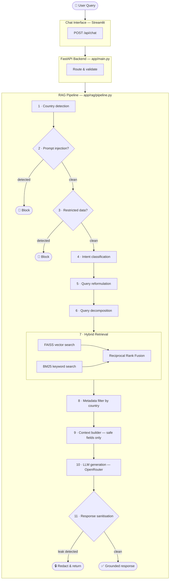
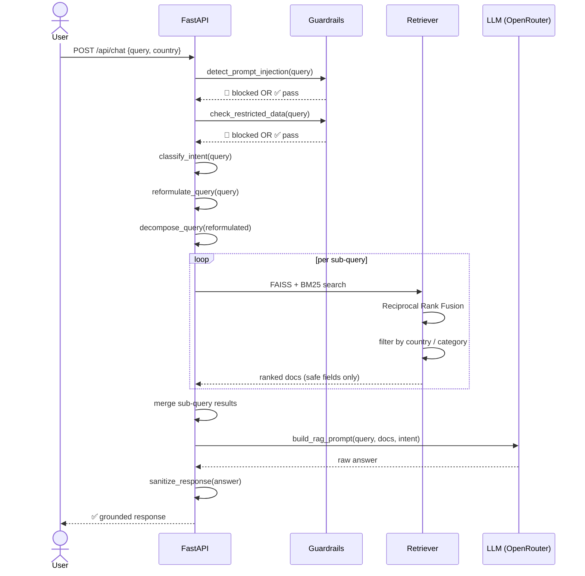
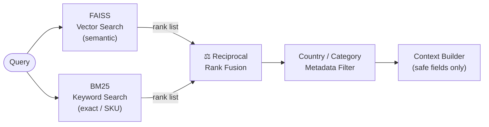

# Architecture

← [Back to README](../README.md) · [Security & Data](security.md)

---

## Table of Contents

- [Solution Architecture](#solution-architecture)
- [System Workflow](#system-workflow)
- [Key Features](#key-features)
  - [Hybrid Search](#hybrid-search--vector--keyword)
  - [Multi-Country Filtering](#multi-country-metadata-filtering)
  - [Query Reformulation + Decomposition](#query-reformulation--decomposition)
  - [Hierarchical Retrieval](#hierarchical-retrieval)
- [Repository Structure](#repository-structure)
- [Technology Stack](#technology-stack)

---

## Solution Architecture

The system is composed of three layers: a **Streamlit chat UI**, a **FastAPI backend**, and a **RAG pipeline** that handles security, retrieval, and generation.



---

## System Workflow

The sequence diagram shows the exact message flow between components for a single query.



---

## Key Features

### Hybrid Search — Vector + Keyword

Semantic search alone misses exact product identifiers (`NL-L-5042`). Keyword search alone misses intent. The retriever combines both via **Reciprocal Rank Fusion (RRF)** — no score normalisation required, robust to score distribution differences between the two systems.



| Query type | Handled by | Example |
|---|---|---|
| Semantic intent | FAISS | *"energy-saving smart kettle"* |
| Exact SKU / code | BM25 | *"NL-L-5042"* |
| Both | RRF fusion | *"price of GH-K-001 in Ghana"* |

### Multi-Country Metadata Filtering

Country is resolved from:
1. The explicit `country` parameter on the request, or
2. Named entities in the query text (`"Ghana"`, `"Netherlands"`, `"UK"`, `"nl"` …)

Multi-country queries (`"Ghana and Nigeria"`) expand the fetch budget (`k × num_countries`) so each region gets adequate coverage, then results are merged by score.

If no country is detected the filter is skipped and global results are returned.

### Query Reformulation + Decomposition

**Reformulation** (`app/rag/query_reformulation.py`): expands abbreviations and adds synonyms before embedding — e.g. `price` → `price cost`, `specs` → `specifications technical details`. This improves vector recall for terse queries.

**Decomposition** (`app/rag/query_decomposition.py`): splits compound questions into independent sub-queries (max 5), retrieves for each, then merges results keeping the highest score per document. Prevents a multi-part question from being dominated by only the first part's semantics.

### Hierarchical Retrieval

Intent classification (`app/rag/intent_classifier.py`) determines document type priority:

| Intent | Boost applied |
|---|---|
| `WARRANTY_POLICY` | Policy documents +1.5 RRF score |
| All other intents | Product documents ranked first by default |

This ensures a warranty question surfaces policy documents even if a product document has a slightly higher raw RRF score.

---

## Repository Structure

```
retail-intelligence/
│
├── app/                          # FastAPI backend
│   ├── api/
│   │   └── chat.py               # POST /api/chat endpoint
│   ├── rag/
│   │   ├── pipeline.py           # End-to-end RAG orchestration
│   │   ├── hybrid_search.py      # FAISS + BM25 + RRF retriever
│   │   ├── retriever.py          # HybridRetriever re-export
│   │   ├── intent_classifier.py  # Intent → doc type priority
│   │   ├── country_filter.py     # NER-style country detection
│   │   ├── metadata_filter.py    # ALLOWED_RETURN_FIELDS enforcer
│   │   ├── query_reformulation.py
│   │   ├── query_decomposition.py
│   │   └── prompt_builder.py     # System prompt + context assembly
│   ├── guardrails/
│   │   ├── prompt_injection.py   # Regex injection detector
│   │   └── security_filter.py    # Restricted keyword blocklist
│   ├── services/
│   │   └── query_service.py      # Thin wrapper for external callers
│   ├── index.py                  # Vercel / serverless entrypoint
│   └── main.py                   # FastAPI app + CORS
│
├── pipelines/
│   ├── ingestion/
│   │   ├── clean_data.py         # Strip Internal_Notes, build searchable_text
│   │   └── ingest_task_data.py   # Merge .xlsx task data
│   └── indexing/
│       └── build_vector_index.py # Embed → FAISS + metadata.json
│
├── scripts/                      # uv run entry points
│   ├── generate_retail_dataset.py  # → uv run generate_dataset
│   ├── run_indexing.py             # → uv run build_index
│   └── run_retrieval.py            # → uv run run_retrieval
│
├── frontend/
│   └── chat_app.py               # Streamlit chat UI
│
├── evaluation/
│   └── test_queries.py           # Automated eval suite
│
├── data/
│   ├── raw/                      # Generated / ingested CSVs
│   └── processed/                # Cleaned CSV fed to indexer
│
├── vector_store/
│   └── faiss_index/              # index.faiss + metadata.json
│
├── docs/                         # This directory
│   ├── architecture.md
│   └── security.md
│
├── pyproject.toml                # uv project config + entry points
├── uv.lock                       # Locked dependency tree
└── Dockerfile
```

---

## Technology Stack

| Layer | Technology | Notes |
|---|---|---|
| Package manager | [uv](https://docs.astral.sh/uv/) | Replaces pip + venv + pip-tools |
| Backend | FastAPI + Uvicorn | Async, OpenAPI docs at `/docs` |
| Embeddings | `all-MiniLM-L6-v2` | 384-dim, offline, fast |
| Vector index | FAISS `IndexFlatIP` | Exact cosine search via L2 normalisation |
| Keyword index | BM25 (`rank-bm25`) | Handles SKUs and exact tokens |
| Fusion | Reciprocal Rank Fusion | No score normalisation required |
| LLM | OpenRouter / OpenAI | `openai/gpt-4o-mini` default, swappable via env |
| Frontend | Streamlit | `frontend/chat_app.py` |
| Containerisation | Docker + uv | CPU-only torch via PyTorch index |
